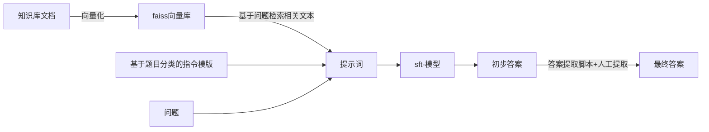

# 电力大模型——技术文档

## 1.赛题分析

__题目__:ChatGLM2-6B 模型为核心制作一 个问答系统，回答电力领域相关的问题。题目类型包含单选题、 多选题和自由问答

__分析__:对于chatglm2-6b进行垂直领域的微调，同时构建相关专业的知识库辅助答案生成

## 2.方案介绍

* __模型训练思路__


* __项目实现思路__



###  2.1项目目录介绍 

* 项目文件目录(powerai_final)

```
│  main.py
│  requirements.txt #主要的包（不包含数据处理即process的py文件所需要的包）
│  run.sh
│  
├─log #日志
├─res
│  ├─data #指令微调数据
│  │      mix_sf.json
│  │      
│  ├─kb
│  │  ├─doc #使用文档
│  │  │      《电工学》（第六版）上册+秦曾煌主编 (1).txt
│  │  │      《电工学》（第六版）下册+秦曾煌主编.txt
│  │  │      注册电器工程师专业知识1-513复习教程.txt
│  │  │      注册电气工程师执业资格考试公共基础.txt
│  │  │      注册电气工程师（专业基础）培训教材上.txt
│  │  │      注册电气工程师（专业基础）培训教材下.txt
│  │  │      电路与电子技术.李晓明.文字版.txt
│  │  │      直流输电控制保护分析及应用-陶瑜.txt
│  │  │      第3册电气与信息技术基础.txt
│  │  │      第4册工程经济与法律法规.txt
│  │  │      
│  │  └─m3e-base #知识库
│  │          index.faiss
│  │          index.pkl
│  │          
│  ├─process #数据集生成
│  │      datapro.py
│  │      selectjson.py
│  │      shuffle.py
│  │      
│  └─qu #问题目录
│          question.json
│          
├─result #结果目录
├─src
│      faiss_kb.py #向量库加载
│      jsonprocess.py #json处理
│      model_load.py #模型加载
│      prompt.py #提示词，使用jinja2语法
│      resprocess.py #回答结果处理
│      
└─test
```

* 模型训练生成程序目录（LLaM）

```
│  ds_config.json #deepspeed 配置文件
│  export.sh #模型的导出脚本
│  requirements.txt 
│  run_pt.sh #预训练脚本
│  run_sft_gpus.sh #参数微调脚本
│  
├─data
│      all.txt
│      dataset_info.json
│      mix_sf.json
│      
├─doc #官方文件
│      .mdl
│      .msc
│      config.json
│      configuration.json
│      configuration_chatglm.py
│      modeling_chatglm.py
│      MODEL_LICENSE
│      quantization.py
│      quickstart.md
│      README.md
│      tokenization_chatglm.py
│      tokenizer.model
│      tokenizer_config.json
│      
└─src
    │  export_model.py
    │  train_bash.py
    │  
    └─llmtuner
        │  __init__.py
        │  
        ├─data
        │      loader.py
        │      preprocess.py
        │      template.py
        │      utils.py
        │      __init__.py
        │      
        ├─eval
        │      evaluator.py
        │      template.py
        │      __init__.py
        │      
        ├─extras
        │  │  callbacks.py
        │  │  constants.py
        │  │  logging.py
        │  │  misc.py
        │  │  packages.py
        │  │  ploting.py
        │  │  __init__.py
        │  │  
        │  └─patches
        │          llama_patch.py
        │          __init__.py
        │          
        ├─hparams
        │      data_args.py
        │      evaluation_args.py
        │      finetuning_args.py
        │      generating_args.py
        │      model_args.py
        │      __init__.py
        │      
        ├─model
        │      adapter.py
        │      loader.py
        │      parser.py
        │      utils.py
        │      __init__.py
        │      
        └─train
            │  tuner.py
            │  utils.py
            │  __init__.py
            │  
            ├─dpo
            │      collator.py
            │      trainer.py
            │      workflow.py
            │      __init__.py
            │      
            ├─ppo
            │      trainer.py
            │      utils.py
            │      workflow.py
            │      __init__.py
            │      
            ├─pt
            │      workflow.py
            │      __init__.py
            │      
            ├─rm
            │      collator.py
            │      metric.py
            │      trainer.py
            │      workflow.py
            │      __init__.py
            │      
            └─sft
                    metric.py
                    trainer.py
                    workflow.py
                    __init__.py
                    
```

### 2.2项目实现

#### 2.2.1指令微调数据集构建


> 分别撰写数据提取，随机打乱，去重等文件

#### 2.2.2模型训练

* 预训练脚本


* 指令微调脚本


#### 2.2.3基于向量库问答的构建


#### 2.2.4 基于问题格式与提交答案形式构建的json处理程序


#### 2.2.5模型调用程序


#### 2.2.6提示词


#### 2.2.7脚本处理模块


2.2.8构建主程序


## 3.试错分析&经验总结

1.本次项目运行使用超算平台，在此之前使用，本次项目中项目成员学习了Slurm 作业调度系统的使用和超算平台上复杂环境的构建。

2.项目所需配置较高，原本计划使用笔记本，后改为云上训练测试运行，期间不断学习linux的操作技巧

3.使用langchain来调用知识库的时候faiss-gpu包的安装错误困扰我们许久

4.项目中多次使用正则表达式对于匹配准确度的问题困扰许久

5.原本项目打算使用accelerate进行分布式计算后受困环境问题转向deepspeed

6.预训练过程中参数的设置困扰我们许久后续如若进入国赛会继续不断尝试

7.指令微调过程中数据的收集十分复杂耗费大量精力，受限于时间精力仍有大量数据未进行过人工筛查和人工标注

8.训练结果不尽人意，后期会进行更多尝试

9.知识库文本原计划准备预处理，但时间实在来不及，只进行了少量处理，导致检索质量不高无法检索出高质量有效内容

## 4.复现帮助

### 1.模型构建

* 模型生成（检查点文件到模型bin文件）

本项目模型进行了两次训练，所以会涉及重复操作

> 请更改以下LLaM目录文件下export.sh的相关路径


（1）先使用原chatglm2-6b模型路径使用pt的检查点文件生成pt模型`sh export.sh`

（2）再进行官方文件与pt-模型文件放置同一目录的操作得到pt模型目录（在LLaM目录下doc提供相应官方文件，具体操作见下图）

（3）将得到的pt模型作为原模型使用sft-模型的检查点文件生成sft模型

（4）将官方文件与sft-模型文件放置同一目录下构成模型文件夹

* 请将官方文件与sft-模型文件放置同一目录下构成模型文件夹


### 2.运行本项目前请创建相应的conda环境

* conda环境创建

``` sh
conda create -n powerai python=3.10
```

* conda 环境激活

``` shell
conda activate powerai
```

* 包的安装

```
pip install -r requirements.txt
```

注：faiss-gpu进行pip安装时可能会出错，如出错可尝试以下两种途径

> * ```shell
>   conda install faiss-gpu
>   ```
>
>   或替换为faiss-cpu并对faiss_kb作出相应更改
>
> * ``` 
>   pip install faiss-cpu
>   ```
>
>   


### 3.使用本项目前请更改如下图箭头所示路径

* 更改模型路径（上述模型文件夹路径）


* 更改题库路径（如使用知识库问答请注释相关代码）


### 4.windows下运行

``` shell
python main.py
```


### 5.如在超算平台（Slurm 作业调度系统）上运行

* 请构建相应conda 环境，并对`run.sh`作出相应更改 


* 运行

```shell
sbatch run.sh
```

本项目利用llama-factory做模型的预训练与指令微调

```
@Misc{llama-factory,
  title = {LLaMA Factory},
  author = {hiyouga},
  howpublished = {\url{https://github.com/hiyouga/LLaMA-Factory}},
  year = {2023}
}
```
